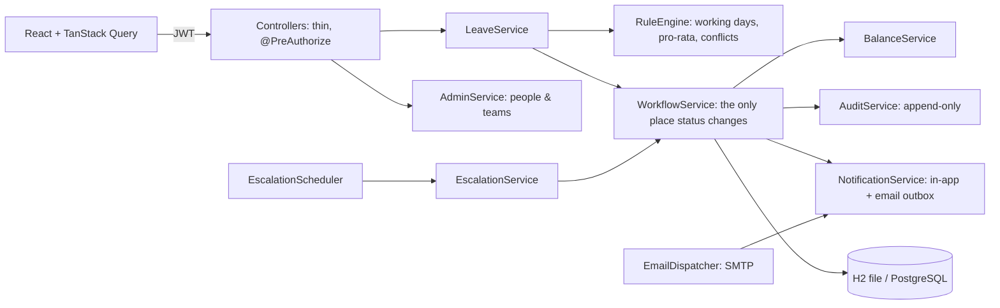

# LeaveFlow: leave management with an explicit approval chain

Employee → Manager → HR, with escalation on timeout, team-conflict flags (never auto-rejects), pro-rated balances that
explain themselves, delegation, an audit timeline, and role-based screens. HR manages people and teams in the app.

Business rules: [`docs/RULES.md`](docs/RULES.md). API contract: [`docs/openapi.yaml`](docs/openapi.yaml)
(plus `/api/admin/*`, `/api/auth/change-password`, `/api/public/config`, `/api/directory`, `/api/analytics/forecast`).

## Run it for real

### Option A: Docker (PostgreSQL + API + web)

```bash
cp .env.example .env      # set DB_PASSWORD, JWT_SECRET (32+ random chars), ADMIN_EMAIL, optionally MAIL_*
docker compose up -d --build
```

Open `http://localhost` (or `WEB_PORT`). Put a TLS-terminating reverse proxy (or load balancer) in front for HTTPS.

### Option B: run the pieces yourself

Needs JDK 17+ and Node 18+.

```bash
# backend: persistent file database in backend/data by default; set DB_URL/DB_USER/DB_PASSWORD and
# SPRING_PROFILES_ACTIVE=postgres for PostgreSQL
export JWT_SECRET="$(openssl rand -base64 48)"
export ADMIN_EMAIL=hr@yourcompany.com        # first HR administrator (created once, on an empty database)
cd backend && ./mvnw spring-boot:run          # http://localhost:8080

# frontend (dev server proxies /api to :8080); for production `npm run build` and serve dist/ behind the same origin
cd frontend && npm install && npm run dev     # http://localhost:5173
```

### First sign-in and setup

1. Sign in as `ADMIN_EMAIL`. With no `ADMIN_PASSWORD` a one-time password is printed once in the backend log.
   You are forced to choose your own password before anything else works (the server enforces this).
2. **People & teams**: add your teams, then managers, then employees (each with a temporary password they must change
   at first sign-in). Set each person's join date: it drives pro-rating of annual leave in their joining year.
3. **Holidays**: add your public holidays (they are excluded from working days).

There is no sample data and no demo login in this mode.

### Configuration (environment variables)

| Variable | Purpose | Default |
|---|---|---|
| `JWT_SECRET` | signing key, **required**, 32+ chars | none (startup fails) |
| `ADMIN_EMAIL`, `ADMIN_PASSWORD`, `ADMIN_NAME` | first HR administrator, used once | none |
| `DB_URL`, `DB_USER`, `DB_PASSWORD`, `DB_DRIVER` | database | H2 file `./data/leaveflow` |
| `ESCALATION_TIMEOUT_MINUTES`, `ESCALATION_CHECK_SECONDS` | manager step deadline and check interval | 2880 (48 h), 300 |
| `MAIL_HOST`, `MAIL_PORT`, `MAIL_USER`, `MAIL_PASSWORD`, `MAIL_FROM` | SMTP; empty host = emails only queued | off |
| `CORS_ORIGINS` | comma-separated origins, only if the UI is on another origin | none (same origin) |
| `LOGIN_MAX_ATTEMPTS`, `LOGIN_LOCK_MINUTES` | sign-in lockout | 5, 15 |
| `SWAGGER_ENABLED` | API docs at `/swagger-ui.html` | false |

### Demo mode (optional)

`SPRING_PROFILES_ACTIVE=demo` (or `./mvnw spring-boot:run -Dspring-boot.run.profiles=demo`) loads the fixed sample data
in [`docs/SEED_SCENARIOS.md`](docs/SEED_SCENARIOS.md) into an in-memory database, runs a demo clock (2026-10-12) with a
1-minute escalation timeout, enables Swagger, and adds demo-only screens (one-click logins, "Simulate timeout",
"Reset demo data"). Password for all demo users is `Password@123`.

## How it works

An employee's request goes to their manager, then HR. A manager's own leave goes to HR. A manager step that is not
decided within the timeout escalates to HR; **the system never approves or rejects on anyone's behalf**. Nobody decides
their own request. Team conflicts (over 30% away) are flagged, never blocked. Balances are reserved on apply and used on
final approval; pro-rata uses the join month fully, rounded to 0.5. Managers can delegate approvals to another manager
for a date range.

Screens: employees apply (live check of working days, balance and conflicts, with alternative dates), see balances
with their calculation, and track requests with an audit timeline. Managers get an approvals inbox with a countdown,
a team calendar and delegation. HR gets the queue, escalations, analytics with a 30-day capacity forecast, holidays,
and people & teams.



## Security

- All authorization is enforced on the backend (role checks plus ownership/approver checks in the services).
- Passwords are BCrypt-hashed (cost 12); policy is 10+ characters with a letter and a digit. New and reset accounts must
  change the temporary password before any other call works (enforced with a token claim, not just the UI).
- Sign-in lockout after repeated failures (also for unknown emails, so accounts cannot be probed).
- The JWT secret has no default; H2 console and Swagger are off unless enabled; errors never include stack traces;
  people are deactivated, never deleted; guards prevent removing the last HR user or orphaning a team's employees.
- Requests use optimistic locking: two simultaneous decisions cannot both apply.

## Tests

`cd backend && ./mvnw test`: **55 tests**, all passing.

- `StateMachineTest` (4), `RuleEngineTest` (21): transitions vs the rules table; pro-rata and working days.
- `ApiFlowTest` (23, demo profile): the full workflow over HTTP on the sample data, including concurrent approval,
  escalation, delegation, forecast, access control.
- `RealModeTest` (7, production configuration): first-run admin, forced password change, HR creating people, a real
  request approved end to end, safety guards, password reset, lockout, demo endpoints absent.

## Known gaps

- **Not verified here:** the Docker files and PostgreSQL profile (no Docker/Postgres available), SMTP delivery, and
  the new screens in a browser (the browser tool disconnected; the API behind them is covered by tests and a live
  smoke test).
- Lockout counters are in memory (per instance); for several backend instances add a shared store. The escalation
  scheduler would need ShedLock (or similar) with several instances.
- No password reset by email, SSO, multi-factor sign-in, or year-end carry-forward (not in the rules).
- Escalation is one tier (manager → HR) as the rules define. Suggested alternative dates are probed by the browser
  through the preview endpoint. Schema changes use Hibernate `ddl-auto: update`; use Flyway/Liquibase for controlled
  migrations in a strict production setup.
