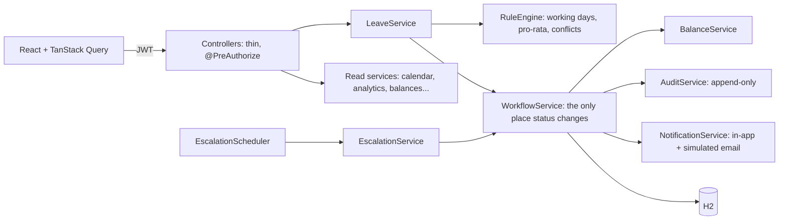

# LeaveFlow: leave management with an explicit approval chain

Employee → Manager → HR, with escalation on timeout, team-conflict *flags* (never auto-rejects), pro-rated balances
that explain themselves, delegation, an audit timeline, and role-based UIs.

The business rules are frozen in [`docs/RULES.md`](docs/RULES.md), the fixed demo data in
[`docs/SEED_SCENARIOS.md`](docs/SEED_SCENARIOS.md), the API contract in [`docs/openapi.yaml`](docs/openapi.yaml).

## Run

Needs JDK 17+ and Node 18+.

```bash
# backend  (http://localhost:8080, Swagger UI at /swagger-ui.html)
cd backend && ./mvnw spring-boot:run          # Windows: mvnw.cmd spring-boot:run

# frontend (http://localhost:5173, proxies /api to :8080)
cd frontend && npm install && npm run dev
```

Demo logins (password `Password@123`): `asha@` (employee), `ravi@` (new joiner), `priya@` (manager), `arjun@`
(manager), `meena@` (HR), all `@leave.demo`. The login page has one-click buttons.

The app runs on a demo clock (`leave.demo-now` in `application.yml`, 2026-10-12 10:00 IST) so the fixed seed dates line
up. Remove it to use real time. HR can reload the seed from the sidebar ("Reset demo data").

## Architecture



## State machine (`WorkflowService`)

| From | To | Trigger |
|---|---|---|
| (new) | PENDING_MANAGER / PENDING_HR | employee applies / manager applies (own leave goes to HR) |
| PENDING_MANAGER | PENDING_HR or APPROVED | manager (or delegate) approves; APPROVED if the type needs no HR |
| PENDING_MANAGER | ESCALATED | timeout (system) |
| PENDING_MANAGER / ESCALATED / PENDING_HR | REJECTED | current approver rejects, comment required |
| ESCALATED / PENDING_HR | APPROVED | HR approves |
| any open state | CANCELLED | owner cancels (HR may cancel an approved request) |

## Design decisions

- **Explicit transition table**, not Spring Statemachine: a readable map is what "explicit" means, and a test checks
  every (from, action, to) combination against `RULES.md`.
- **Flag, never reject**, for team conflicts. The approver decides with the information in front of them.
- **Escalation never auto-approves or auto-rejects.** It only moves the request to HR. Deciding on someone's behalf is
  a compliance risk; the system only makes sure a human is looking at it.
- **Optimistic locking** (`@Version`) on requests: two simultaneous decisions cannot both apply; the loser gets 409.
- **`Clock` injected everywhere**, so tests and the demo can control time.
- **Escalation runs one transaction per request** and is idempotent. For multiple instances you would add ShedLock
  (not implemented).
- **Authorization is on the backend**: role checks with `@PreAuthorize`, ownership and approver checks in the services.
  The UI only hides what you cannot use.

## Tests

`cd backend && ./mvnw test`: **47 tests**, all passing.

- `StateMachineTest` (4): every status × action × target against the rules table, terminal states.
- `RuleEngineTest` (21): pro-rata (joins on 1st/last day, Jan 1, Dec 31, before/after the year, rounding) and working days.
- `ApiFlowTest` (22, over HTTP on the seed): auth, role and row-level access, balances, conflict flag, insufficient
  balance (422), no-working-days, overlap (409), self-approval blocked, full delegate → HR happy path with balance
  checks at each step and cancel, rejection needs a comment, escalation (simulate and scheduled, idempotent), a
  concurrent double approval, lists/filters, calendar, analytics, notifications, delegation, holidays, error format.

## 3-minute demo

1. **Pro-rata (30s).** Sign in as *Ravi* → My balances: `24 × 6/12 = 12.0`, with the formula shown.
2. **Conflict flag (40s).** Sign in as *Asha* → Apply, Annual, 4–5 Nov 2026: the live check flags team coverage and
   offers "Try these dates instead". Submitting is still allowed.
3. **Approval chain + delegation (50s).** *Priya* → Inbox: Arjun's requests are here because he delegated to her. Open
   one: approval chain, audit timeline, highlighted workflow diagram. Approve; sign in as *Meena* and give the final approval.
4. **Escalation (40s).** As *Priya* open Ravi's request → "Simulate timeout". It becomes *Escalated to HR*; *Meena* sees
   it under Escalations. (Real timeouts fire after 1 minute for new requests.)
5. **HR view (20s).** Meena → Analytics: trend, status mix, escalation rate, team load.

## Known gaps

- No team-capacity forecast chart, carry-forward, or `/api/workflow/definition`; the UI draws the diagram from the
  documented transitions.
- Suggested alternative dates are found by the browser probing shifted windows through the preview endpoint, not by a
  dedicated backend search.
- Email is simulated (outbox rows). H2 is in-memory (a Postgres profile is provided but untested).
- Escalation is one tier (manager → HR), as the frozen rules define; there is no reminder or skip-level tier.
- `GET /api/directory` is an addition to the contract (teams and managers for pickers).
