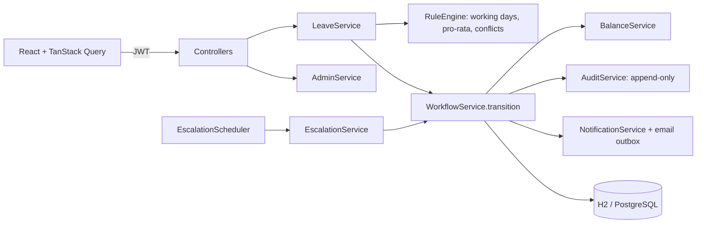

# LeaveFlow: leave management with an explicit approval chain

Employee → Manager → HR, with escalation on timeout, team-conflict flags (never auto-rejects), pro-rated balances that
explain themselves, delegation, an audit timeline, and role-based screens. HR manages people and teams in the app.

Docs: [`docs/RULES.md`](docs/RULES.md) (business rules), [`docs/openapi.yaml`](docs/openapi.yaml) (API contract, plus
the additions listed at the end), [`docs/SEED_SCENARIOS.md`](docs/SEED_SCENARIOS.md) (sample data),
[`docs/DEMO_SCRIPT.md`](docs/DEMO_SCRIPT.md) (5-minute walkthrough), `docs/screenshots/` (UI check output).

## AI assistance disclosure

This project was built with an AI coding assistant (Claude Code). The commits carry `Co-Authored-By` trailers
recording that. The tests, browser checks and results reported in this README were run against the code as committed.

## 1. Run the demo first

Needs JDK 17+ and Node 18+. Two terminals:

```bash
# terminal 1: backend, demo profile (in-memory database, sample company, demo clock, Swagger)
cd backend
SPRING_PROFILES_ACTIVE=demo ./mvnw spring-boot:run        # Windows PowerShell: $env:SPRING_PROFILES_ACTIVE="demo"; .\mvnw.cmd spring-boot:run

# terminal 2: frontend
cd frontend && npm install && npm run dev
```

Open http://localhost:5173. Swagger UI: http://localhost:8080/swagger-ui.html. The login page has one-click persona cards.
All demo users share the password **`Password@123`**:

| Persona | Email | Notes |
|---|---|---|
| HR | `meena@leave.demo` | final approvals, escalations, analytics, people, holidays |
| Manager (Engineering) | `priya@leave.demo` | also holds Arjun's delegated approvals (8-23 Oct) |
| Manager (Product) | `arjun@leave.demo` | delegated his approvals to Priya |
| New joiner | `ravi@leave.demo` | joined 20 Jul 2026, so annual leave is pro-rated to 12 |
| Employee | `asha@leave.demo` | Engineering |
| Balance edge case | `karan@leave.demo` | 0 annual days available |

The full data set (15 people, 18 requests in every state) is in `docs/SEED_SCENARIOS.md`. The demo clock starts at
12 Oct 2026, 10:00 IST and keeps ticking; a manager step times out after 1 minute. Demo-only extras: **Simulate timeout**
on a waiting request, and **Reset demo data** (HR sidebar) to restore a clean state.

## 2. Real mode (production setup)

Real mode is the default (no `demo` profile): no sample data, no demo logins, persistent database.

```bash
export JWT_SECRET="$(openssl rand -base64 48)"     # required, 32+ chars; startup fails without it
export ADMIN_EMAIL=hr@yourcompany.com              # first HR administrator, created once on an empty database
cd backend && ./mvnw spring-boot:run               # persistent H2 file at backend/data by default
cd frontend && npm install && npm run dev          # or `npm run build` and serve dist/ behind the same origin
```

First sign-in: use `ADMIN_EMAIL` with `ADMIN_PASSWORD` (or the one-time password printed in the backend log). You are
forced to choose your own password first (the server enforces it). Then use **People & teams** (teams, managers,
employees, each with a temporary password they must change) and **Holidays**.

| Variable | Purpose | Default |
|---|---|---|
| `JWT_SECRET` | signing key, required | none |
| `ADMIN_EMAIL`, `ADMIN_PASSWORD`, `ADMIN_NAME` | first HR administrator, used once | none |
| `DB_URL`, `DB_USER`, `DB_PASSWORD`, `DB_DRIVER` (+ `SPRING_PROFILES_ACTIVE=postgres`) | database | H2 file `./data/leaveflow` |
| `ESCALATION_TIMEOUT_MINUTES`, `ESCALATION_CHECK_SECONDS` | manager deadline, check interval | 2880 (48 h), 300 |
| `MAIL_HOST`, `MAIL_PORT`, `MAIL_USER`, `MAIL_PASSWORD`, `MAIL_FROM` | SMTP; empty host = emails only queued | off |
| `CORS_ORIGINS` | comma-separated origins, only if the UI is on another origin | none |
| `LOGIN_MAX_ATTEMPTS`, `LOGIN_LOCK_MINUTES` | sign-in lockout | 5, 15 |
| `SWAGGER_ENABLED` | API docs | false |

Docker files are provided (`docker-compose.yml`: PostgreSQL + API + nginx-served UI, `.env.example`) but are
**untested**: Docker is not available in the environment this was built in.

## 3. Rules reference (full text in `docs/RULES.md`)

- **Conflicts are flagged, never rejected.** If more than 30% of a team would be away on any day, the request is flagged
  and the approver sees why; submitting and approving are still allowed.
- **Balance is deducted only on final approval.** Applying reserves days as *pending*; the manager's approval changes
  nothing; the last approval moves pending → used. Reject/cancel while pending releases pending; cancelling an approved
  request releases used. Requests above the available balance are refused (422); unpaid leave has no balance.
- **Pro-rata:** the join month counts fully, rounded to the nearest 0.5: 24 × 6/12 = 12 for a July joiner.
- **Weekends and holidays are excluded** from working days; a range with no working days is rejected.
- **Illegal transitions return 409** in the standard `{code, message, details}` shape, with no stack trace (for example
  approving an already approved request). Wrong role or someone else's request is 403; no token is 401.
- Nobody decides their own request (HR included). A manager's own leave goes straight to HR. Escalation after the
  timeout hands the request to HR; the system never approves or rejects for anyone.

## 4. Architecture

Layered: controllers (thin, `@PreAuthorize`) → services → repositories → entities/DTOs; DTOs only cross the API.



- **`WorkflowService.transition()` is the single gateway for status changes.** It checks the move against an explicit
  transition table, checks who may do it, applies the balance effect, updates approval steps, writes the audit event and
  sends notifications, all in one transaction. Nothing else sets a status.
- **Escalation is idempotent and safe under concurrency.** The scheduler loops over overdue manager steps and escalates
  each one in its own transaction; a request that is no longer waiting on its manager is skipped, and requests carry an
  optimistic-lock version, so a manager approving at the same moment either wins or the second action gets 409.
- The clock is injected everywhere (no direct `now()`), which is how tests and the demo control time.
- Security: backend-enforced roles and ownership, BCrypt, password policy, forced first-login password change, sign-in
  lockout, no default JWT secret, no stack traces in responses.

## 5. Tests and checks

- `cd backend && ./mvnw test`: **55 tests** (state machine 4, rules 21, demo-profile API flows 23, real-mode setup 7).
- `cd frontend && npx tsc --noEmit && npm run build`.
- With the demo stack running: `cd frontend && node e2e-check.mjs` (Playwright with the installed Edge; 12 UI checks,
  screenshots to `docs/screenshots/`).

## 6. Not built

- Password reset by email, SSO, multi-factor sign-in.
- Year-end carry-forward.
- Also: the escalation is a single tier (manager → HR) as the rules define; schema changes rely on Hibernate
  `ddl-auto: update` (use Flyway/Liquibase for strict production); lockout counters are per instance.

API additions beyond the original contract: `/api/admin/*` (people and teams), `/api/auth/change-password`,
`/api/public/config`, `/api/directory`, `/api/analytics/forecast`.
